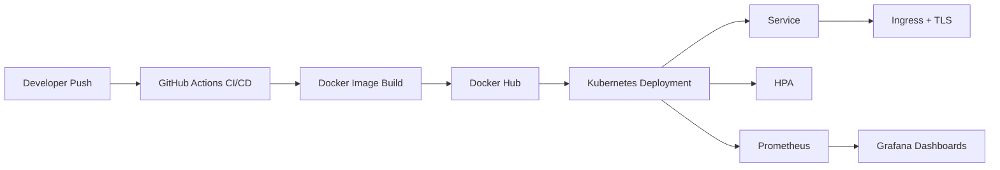

# Scalable Application Deployment with Kubernetes, CI/CD, and Monitoring

Production-ready DevOps project demonstrating how to containerize, deploy, scale, and observe a modern web application using Kubernetes, GitHub Actions, Prometheus, Grafana, and Terraform.

## Project Overview

This project showcases an end-to-end DevOps workflow for running a FastAPI application in a Kubernetes environment with automated delivery, autoscaling, health checks, and observability built in.

It is designed to reflect the kind of work expected in real engineering teams:

- Packaging an application with Docker
- Deploying it safely to Kubernetes
- Automating delivery with CI/CD
- Scaling it based on demand
- Monitoring application and cluster health
- Provisioning infrastructure with Terraform

This repository is intentionally structured to be both beginner-friendly and interview-ready, with clear separation between application code, deployment manifests, monitoring configuration, CI/CD, and infrastructure.

## Why This Project Matters

This project demonstrates practical DevOps skills that recruiters and hiring managers typically look for:

- Kubernetes deployment design
- Production container hardening
- CI/CD pipeline implementation
- Autoscaling strategy
- Monitoring and observability setup
- Infrastructure as Code
- Secure configuration management

## Architecture

At a high level, the flow works like this:

1. Developers push code changes to GitHub.
2. GitHub Actions runs tests and builds the Docker image.
3. The image is pushed to Docker Hub.
4. Kubernetes deploys the application using rolling updates.
5. Ingress exposes the service through a custom domain.
6. cert-manager provisions TLS certificates for HTTPS.
7. Horizontal Pod Autoscaler scales pods based on CPU and memory usage.
8. Prometheus scrapes metrics from the application and cluster.
9. Grafana visualizes health, CPU, memory, and pod-level metrics.



## Simple Architecture Explanation

Here is the easiest way to explain the architecture in an interview:

1. The FastAPI application runs inside a Docker container.
2. Kubernetes manages the application pods and keeps the desired number running.
3. A Kubernetes Service gives the pods a stable internal endpoint.
4. An Ingress exposes the application to users through a real domain name.
5. cert-manager automatically issues and renews the TLS certificate for HTTPS.
6. GitHub Actions handles CI/CD by testing the code, building the image, and deploying it.
7. The Horizontal Pod Autoscaler increases or decreases pod count based on CPU and memory usage.
8. Prometheus collects metrics from the app and the cluster.
9. Grafana displays those metrics in dashboards so performance and health are easy to understand.

In one sentence:

"This project shows how an application moves from source code to a secure, auto-scaling, monitored Kubernetes deployment."

## Tech Stack

### Application

- FastAPI
- Uvicorn
- Gunicorn
- Pytest

### Containerization

- Docker
- Multi-stage image build

### Orchestration

- Kubernetes
- Kustomize
- Horizontal Pod Autoscaler
- Ingress
- cert-manager

### CI/CD

- GitHub Actions

### Monitoring

- Prometheus
- Grafana
- ServiceMonitor
- Example metrics output

### Infrastructure

- Terraform
- AWS EC2
- k3s

## Repository Structure

```text
.
|-- app/
|   |-- main.py
|   |-- Dockerfile
|   `-- tests/
|-- k8s/
|   |-- deployment.yaml
|   |-- service.yaml
|   |-- ingress.yaml
|   |-- hpa.yaml
|   |-- networkpolicy.yaml
|   |-- secret.yaml
|   `-- cluster-issuer.yaml
|-- monitoring/
|   |-- prometheus-values.yaml
|   |-- grafana-admin-secret.example.yaml
|   |-- app-servicemonitor.yaml
|   |-- prometheus-rules.yaml
|   |-- loki-values.yaml
|   |-- promtail-values.yaml
|   |-- example-metrics.txt
|   `-- grafana-dashboard-configmap.yaml
|-- load-testing/
|   `-- hpa-demo.js
|-- terraform/
|   |-- main.tf
|   |-- variables.tf
|   `-- userdata.sh.tftpl
`-- .github/
    `-- workflows/
        `-- ci-cd.yaml
```

## Key Features

### CI/CD Pipeline

- Automated test execution on every push and pull request
- Docker image build and push through GitHub Actions
- Kubernetes deployment as part of the release flow
- Automatic rollback if rollout verification fails
- Rollout verification and failure diagnostics
- Build caching for faster pipeline execution
- Filesystem and image security scanning with Trivy

### Auto-Scaling

- Horizontal Pod Autoscaler using `autoscaling/v2`
- CPU and memory-based scaling
- Scale-up and scale-down policies for more stable behavior
- Resource requests and limits to support predictable scheduling

### Monitoring and Observability

- `/metrics` endpoint exposed for Prometheus
- ServiceMonitor for Kubernetes-native scraping
- Grafana dashboard for pod CPU, memory, and readiness
- Health endpoints for liveness, readiness, and startup checks

### Security and Reliability

- Non-root container runtime
- Read-only root filesystem
- Kubernetes Secrets for sensitive configuration
- TLS-enabled ingress
- NetworkPolicy to reduce unnecessary pod-to-pod access
- Pod disruption protection and rollout safeguards

## Application Endpoints

- `/` - Basic application response
- `/health` - General health endpoint
- `/livez` - Liveness probe endpoint
- `/readyz` - Readiness probe endpoint
- `/metrics` - Prometheus metrics endpoint

## Step-by-Step Setup

## 1. Clone the Repository

```bash
git clone <your-repository-url>
cd "Production Ready Scalable App Deployment with Auto Scaling & Monitoring"
```

## 2. Run the Application Locally

### Linux or macOS

```bash
python -m venv .venv
source .venv/bin/activate
pip install -r app/requirements-dev.txt
pytest app/tests
uvicorn app.main:app --host 0.0.0.0 --port 8000 --reload
```

### PowerShell

```powershell
py -m venv .venv
.venv\Scripts\Activate.ps1
pip install -r app/requirements-dev.txt
pytest app/tests
uvicorn app.main:app --host 0.0.0.0 --port 8000 --reload
```

Test locally:

- `http://localhost:8000/`
- `http://localhost:8000/health`
- `http://localhost:8000/metrics`

## 3. Build and Run with Docker

```bash
docker build -f app/Dockerfile -t your-dockerhub-username/fastapi-k8s-app:latest .
docker run -p 8000:8000 your-dockerhub-username/fastapi-k8s-app:latest
```

## 4. Provision Infrastructure with Terraform

Go to the Terraform directory and copy the example variables file.

### Linux or macOS

```bash
cd terraform
cp terraform.tfvars.example terraform.tfvars
```

### PowerShell

```powershell
Set-Location terraform
Copy-Item terraform.tfvars.example terraform.tfvars
```

Update the following values in `terraform.tfvars`:

- `aws_region`
- `key_pair_name`
- `public_key_path`
- `allowed_cidr`

Run Terraform:

```bash
terraform init
terraform plan
terraform apply
```

After provisioning, download the kubeconfig using the Terraform output.

## 5. Prepare Kubernetes Configuration

Before deploying, update the placeholder values in these files:

- [k8s/deployment.yaml](C:\Users\shiva\OneDrive\Desktop\Production Ready Scalable App Deployment with Auto Scaling & Monitoring\k8s\deployment.yaml) for the container image
- [k8s/ingress.yaml](C:\Users\shiva\OneDrive\Desktop\Production Ready Scalable App Deployment with Auto Scaling & Monitoring\k8s\ingress.yaml) for the domain name
- [k8s/cluster-issuer.yaml](C:\Users\shiva\OneDrive\Desktop\Production Ready Scalable App Deployment with Auto Scaling & Monitoring\k8s\cluster-issuer.yaml) for the certificate email
- [k8s/secret.yaml](C:\Users\shiva\OneDrive\Desktop\Production Ready Scalable App Deployment with Auto Scaling & Monitoring\k8s\secret.yaml) for application secrets

Important:

- Install an NGINX Ingress Controller in the cluster
- Install cert-manager in the cluster
- Point your DNS record to the ingress public IP or load balancer
- Do not store real secrets in git for production use

## 6. Deploy to Kubernetes

```bash
kubectl apply -f k8s/cluster-issuer.yaml
kubectl apply -f k8s/namespace.yaml
kubectl apply -f k8s/serviceaccount.yaml
kubectl apply -f k8s/secret.yaml
kubectl apply -f k8s/configmap.yaml
kubectl apply -f k8s/service.yaml
kubectl apply -f k8s/deployment.yaml
kubectl apply -f k8s/hpa.yaml
kubectl apply -f k8s/pdb.yaml
kubectl apply -f k8s/ingress.yaml
```

Verify the deployment:

```bash
kubectl get pods -n scalable-app
kubectl get svc -n scalable-app
kubectl get ingress -n scalable-app
kubectl get hpa -n scalable-app
```

## 7. Install Monitoring

Create the monitoring namespace first:

```bash
kubectl apply -f monitoring/namespace.yaml
```

Then create the Grafana admin secret:

```bash
kubectl apply -f monitoring/grafana-admin-secret.example.yaml
```

Replace the placeholder password before using it, or create the secret manually from your CI/CD or secret manager in a real environment.

Then install the monitoring stack:

```bash
helm repo add prometheus-community https://prometheus-community.github.io/helm-charts
helm repo update
helm upgrade --install kube-prometheus-stack prometheus-community/kube-prometheus-stack \
  --namespace monitoring \
  --values monitoring/prometheus-values.yaml

kubectl apply -f monitoring/app-servicemonitor.yaml
kubectl apply -f monitoring/prometheus-rules.yaml
kubectl apply -f monitoring/grafana-dashboard-configmap.yaml
```

Open Grafana locally:

```bash
kubectl port-forward svc/kube-prometheus-stack-grafana 3000:80 -n monitoring
```

Use the username and password stored in the `grafana-admin-credentials` Secret.

Install centralized logging with Loki and Promtail:

```bash
helm repo add grafana https://grafana.github.io/helm-charts
helm repo update
helm upgrade --install loki grafana/loki -n monitoring -f monitoring/loki-values.yaml
helm upgrade --install promtail grafana/promtail -n monitoring -f monitoring/promtail-values.yaml
```

## 8. Configure CI/CD

Add the following GitHub repository secrets:

- `DOCKERHUB_USERNAME`
- `DOCKERHUB_TOKEN`
- `KUBE_CONFIG_DATA`

The CI/CD workflow will:

1. Install dependencies
2. Run tests
3. Build the Docker image
4. Push the image to Docker Hub
5. Deploy to Kubernetes
6. Verify the rollout

## 9. Load Testing and Validation

This project includes a `k6` script in [load-testing/hpa-demo.js](C:\Users\shiva\OneDrive\Desktop\Production Ready Scalable App Deployment with Auto Scaling & Monitoring\load-testing\hpa-demo.js) to demonstrate Horizontal Pod Autoscaler behavior under sustained traffic.

### Install k6

On macOS:

```bash
brew install k6
```

On Windows:

```powershell
winget install k6.k6
```

On Linux:

```bash
docker run --rm -i grafana/k6 run - < load-testing/hpa-demo.js
```

### Port-forward the application for testing

```bash
kubectl port-forward svc/fastapi-app 8080:80 -n scalable-app
```

### Run the load test

```bash
k6 run -e TARGET_URL=http://localhost:8080 load-testing/hpa-demo.js
```

Docker-based alternative:

```bash
docker run --rm --network host -e TARGET_URL=http://localhost:8080 -v "${PWD}:/work" -w /work grafana/k6 run load-testing/hpa-demo.js
```

### Watch autoscaling in another terminal

```bash
kubectl get hpa -n scalable-app -w
```

You can also observe pod scaling:

```bash
kubectl get pods -n scalable-app -w
```

## Live Demo Walkthrough

This is a simple step-by-step flow you can use during an interview demo.

### 1. Show the application is healthy

```bash
kubectl get pods -n scalable-app
kubectl port-forward svc/fastapi-app 8080:80 -n scalable-app
curl http://localhost:8080/health
curl http://localhost:8080/readyz
```

### 2. Show the autoscaler before load

```bash
kubectl get hpa -n scalable-app
kubectl get pods -n scalable-app
```

Example before-load output:

```text
NAME          REFERENCE                TARGETS          MINPODS   MAXPODS   REPLICAS   AGE
fastapi-app   Deployment/fastapi-app   12%/65%, 28%/75% 3         12        3          18m
```

```text
NAME                           READY   STATUS    RESTARTS   AGE
fastapi-app-7f6b7c8d8d-9k2br   1/1     Running   0          18m
fastapi-app-7f6b7c8d8d-fjv4r   1/1     Running   0          18m
fastapi-app-7f6b7c8d8d-v2qxm   1/1     Running   0          18m
```

### 3. Start live watches in separate terminals

```bash
kubectl get hpa -n scalable-app -w
```

```bash
kubectl get pods -n scalable-app -w
```

### 4. Run the load test

```bash
k6 run -e TARGET_URL=http://localhost:8080 load-testing/hpa-demo.js
```

### 5. Show scaling after load

Example after-load output:

```text
NAME          REFERENCE                TARGETS           MINPODS   MAXPODS   REPLICAS   AGE
fastapi-app   Deployment/fastapi-app   78%/65%, 82%/75% 3         12        6          24m
```

```text
NAME                           READY   STATUS    RESTARTS   AGE
fastapi-app-7f6b7c8d8d-9k2br   1/1     Running   0          24m
fastapi-app-7f6b7c8d8d-fjv4r   1/1     Running   0          24m
fastapi-app-7f6b7c8d8d-v2qxm   1/1     Running   0          24m
fastapi-app-7f6b7c8d8d-c4j8p   1/1     Running   0          2m
fastapi-app-7f6b7c8d8d-h7nrt   1/1     Running   0          2m
fastapi-app-7f6b7c8d8d-zm5ks   1/1     Running   0          1m
```

### 6. Show monitoring

```bash
kubectl port-forward svc/kube-prometheus-stack-grafana 3000:80 -n monitoring
```

Then explain that Grafana visualizes:

- Pod CPU usage
- Pod memory usage
- Ready pod count
- Application request metrics from Prometheus

### 7. Close with CI/CD

Show the GitHub Actions workflow file and explain the release flow:

```bash
kubectl rollout status deployment/fastapi-app -n scalable-app
```

Key talking point:

- Code push triggers tests, Docker image build, image push, Kubernetes deploy, and rollout verification

## How To Demonstrate This Project Live

Use this short flow when you want to show the project in a practical interview setting.

### 1. Show the deployment is healthy

```bash
kubectl get deployment fastapi-app -n scalable-app
kubectl get pods -n scalable-app
kubectl get svc fastapi-app -n scalable-app
kubectl get ingress fastapi-app -n scalable-app
```

### 2. Show the autoscaler before traffic

```bash
kubectl get hpa fastapi-app -n scalable-app
kubectl get pods -n scalable-app
```

Example output before load:

```text
NAME          REFERENCE                TARGETS            MINPODS   MAXPODS   REPLICAS   AGE
fastapi-app   Deployment/fastapi-app   10%/65%, 22%/75%  3         12        3          22m
```

```text
NAME                           READY   STATUS    RESTARTS   AGE
fastapi-app-7f6b7c8d8d-9k2br   1/1     Running   0          22m
fastapi-app-7f6b7c8d8d-fjv4r   1/1     Running   0          22m
fastapi-app-7f6b7c8d8d-v2qxm   1/1     Running   0          22m
```

### 3. Start live watches in separate terminals

Watch HPA:

```bash
kubectl get hpa -n scalable-app -w
```

Watch pods:

```bash
kubectl get pods -n scalable-app -w
```

### 4. Port-forward the app

```bash
kubectl port-forward svc/fastapi-app 8080:80 -n scalable-app
```

### 5. Run the load test

```bash
k6 run -e TARGET_URL=http://localhost:8080 load-testing/hpa-demo.js
```

### 6. Show scaling after traffic increases

Expected HPA output:

```text
NAME          REFERENCE                TARGETS            MINPODS   MAXPODS   REPLICAS   AGE
fastapi-app   Deployment/fastapi-app   79%/65%, 81%/75%  3         12        6          28m
```

Expected pod output:

```text
NAME                           READY   STATUS    RESTARTS   AGE
fastapi-app-7f6b7c8d8d-9k2br   1/1     Running   0          28m
fastapi-app-7f6b7c8d8d-fjv4r   1/1     Running   0          28m
fastapi-app-7f6b7c8d8d-v2qxm   1/1     Running   0          28m
fastapi-app-7f6b7c8d8d-c4j8p   1/1     Running   0          3m
fastapi-app-7f6b7c8d8d-h7nrt   1/1     Running   0          2m
fastapi-app-7f6b7c8d8d-zm5ks   1/1     Running   0          1m
```

### 7. Explain what just happened

Use this simple explanation:

- The load test increased traffic to the application
- CPU and memory usage crossed the HPA thresholds
- Kubernetes increased the number of pods from 3 to 6
- New pods became ready and started serving traffic

### 8. Finish with monitoring

```bash
kubectl port-forward svc/kube-prometheus-stack-grafana 3000:80 -n monitoring
```

Then explain that Grafana shows:

- CPU usage by pod
- Memory usage by pod
- Ready pod count
- Request metrics scraped from Prometheus

## 10. Verification Commands

Use these commands to validate the deployment after rollout.

### Check core resources

```bash
kubectl get all -n scalable-app
kubectl get ingress -n scalable-app
kubectl get hpa -n scalable-app
kubectl get pdb -n scalable-app
```

### Describe deployment state

```bash
kubectl describe deployment fastapi-app -n scalable-app
kubectl describe hpa fastapi-app -n scalable-app
kubectl describe ingress fastapi-app -n scalable-app
```

### Check logs

```bash
kubectl logs deployment/fastapi-app -n scalable-app --tail=100
kubectl logs deployment/fastapi-app -n scalable-app -f
```

### Verify health endpoints

```bash
kubectl port-forward svc/fastapi-app 8080:80 -n scalable-app
curl http://localhost:8080/health
curl http://localhost:8080/livez
curl http://localhost:8080/readyz
```

### Verify metrics endpoint

```bash
curl http://localhost:8080/metrics
```

Representative output is included in [monitoring/example-metrics.txt](C:\Users\shiva\OneDrive\Desktop\Production Ready Scalable App Deployment with Auto Scaling & Monitoring\monitoring\example-metrics.txt).

### Verify resource usage

```bash
kubectl top pods -n scalable-app
kubectl top nodes
```

### Verify rollout status

```bash
kubectl rollout status deployment/fastapi-app -n scalable-app
kubectl rollout history deployment/fastapi-app -n scalable-app
```

## Screenshots

Add polished screenshots here before sharing the project in interviews, on LinkedIn, or in a portfolio.

### Suggested Screenshot Placeholders

- Architecture diagram placeholder
- GitHub Actions pipeline success screen placeholder
- Kubernetes pods and HPA output placeholder
- k6 load test result placeholder
- Grafana dashboard overview placeholder
- Grafana CPU and memory panel placeholder
- Grafana ready pods panel placeholder
- HTTPS application landing page placeholder

Example structure:

```text
docs/
`-- screenshots/
    |-- architecture.png
    |-- github-actions-success.png
    |-- kubernetes-hpa.png
    |-- k6-load-test.png
    |-- grafana-dashboard-overview.png
    |-- grafana-cpu-memory.png
    |-- grafana-ready-pods.png
    `-- https-app-home.png
```

## Example Metrics Output

Prometheus-format metrics from the application are exposed at `/metrics`. Example output:

```text
# HELP http_requests_total Total number of requests by method, status and handler.
# TYPE http_requests_total counter
http_requests_total{handler="/",method="GET",status="2xx"} 154
http_requests_total{handler="/health",method="GET",status="2xx"} 41

# HELP process_resident_memory_bytes Resident memory size in bytes.
# TYPE process_resident_memory_bytes gauge
process_resident_memory_bytes 8.9344e+07
```

For a longer sample, see [monitoring/example-metrics.txt](C:\Users\shiva\OneDrive\Desktop\Production Ready Scalable App Deployment with Auto Scaling & Monitoring\monitoring\example-metrics.txt).

## Troubleshooting

### Pods are not starting

Check events and describe the deployment:

```bash
kubectl describe deployment fastapi-app -n scalable-app
kubectl get events -n scalable-app --sort-by=.lastTimestamp
```

Common causes:

- Invalid image name or missing image in registry
- Secret values not configured correctly
- Readiness probe failing because required runtime config is missing

### Pod is crashing or restarting

Check pod status and recent logs:

```bash
kubectl get pods -n scalable-app
kubectl describe pod <pod-name> -n scalable-app
kubectl logs <pod-name> -n scalable-app --previous
```

Common causes:

- Application process exits because of a bad environment variable
- Secret is missing or invalid
- Liveness probe fails repeatedly and Kubernetes restarts the container

### Readiness probe fails

Inspect logs and test the endpoint manually:

```bash
kubectl logs deployment/fastapi-app -n scalable-app --tail=100
kubectl port-forward svc/fastapi-app 8080:80 -n scalable-app
curl http://localhost:8080/readyz
```

If `/readyz` returns `503`, verify `APP_SECRET_KEY` in [k8s/secret.yaml](C:\Users\shiva\OneDrive\Desktop\Production Ready Scalable App Deployment with Auto Scaling & Monitoring\k8s\secret.yaml).

### HPA does not scale

Check whether metrics-server is installed and whether pod metrics are available:

```bash
kubectl top pods -n scalable-app
kubectl describe hpa fastapi-app -n scalable-app
```

Common causes:

- `metrics-server` is not installed
- Traffic is too low or too short to trigger scaling
- Resource requests are missing or too high for the current load pattern

### Scaling is not working during the live demo

Run these commands:

```bash
kubectl get hpa -n scalable-app
kubectl describe hpa fastapi-app -n scalable-app
kubectl top pods -n scalable-app
kubectl get pods -n scalable-app
```

Quick checks:

- Confirm `metrics-server` is installed
- Confirm the load test is still running
- Confirm the app is receiving traffic through the port-forward
- Confirm pod CPU or memory usage is actually above the HPA target

### HTTPS certificate is not issued

Check ingress and cert-manager resources:

```bash
kubectl describe ingress fastapi-app -n scalable-app
kubectl get challenge,order,certificate -A
kubectl logs -n cert-manager deployment/cert-manager --tail=100
```

Common causes:

- DNS record does not point to the ingress IP
- cert-manager is not installed
- Wrong email or issuer configuration in [k8s/cluster-issuer.yaml](C:\Users\shiva\OneDrive\Desktop\Production Ready Scalable App Deployment with Auto Scaling & Monitoring\k8s\cluster-issuer.yaml)

### Prometheus is not scraping the app

Check the ServiceMonitor and labels:

```bash
kubectl get servicemonitor -n monitoring
kubectl describe servicemonitor fastapi-app -n monitoring
kubectl get svc -n scalable-app --show-labels
```

Common causes:

- Service labels do not match the ServiceMonitor selector
- Prometheus stack is not installed in the expected namespace
- `/metrics` endpoint is not reachable from inside the cluster

## Production Highlights

This project includes several production-style engineering practices:

- Container hardening with a non-root user
- Health probes for safer deployments
- Resource governance through requests and limits
- Horizontal scaling with HPA
- HTTPS with cert-manager and ingress
- Separation of config and secrets
- Monitoring through Prometheus and Grafana
- Centralized logging through Loki and Promtail
- Security scanning and automated rollback in CI/CD
- Infrastructure provisioning with Terraform

## Real-World DevOps Improvements

### Rollback Strategy In CI/CD

The GitHub Actions workflow now performs an automatic rollback if the Kubernetes rollout fails after deployment.

Why this matters:

- A failed deployment should not leave production in a broken state
- Automatic rollback reduces recovery time
- It shows a real production mindset instead of stopping at `kubectl apply`

Implementation:

- Deploy the new version
- Run `kubectl rollout status`
- If the rollout fails, run `kubectl rollout undo`
- Wait for the previous healthy version to become ready

### Health Check Monitoring Alerts

The monitoring setup now includes [monitoring/prometheus-rules.yaml](C:\Users\shiva\OneDrive\Desktop\Production Ready Scalable App Deployment with Auto Scaling & Monitoring\monitoring\prometheus-rules.yaml), which defines alerts for:

- App metrics endpoint down
- Repeated container restarts
- No ready pods
- HPA staying near maximum capacity

Why this matters:

- Health checks alone only tell Kubernetes what to do locally
- Alerts tell operators when something is wrong at the system level
- This helps teams respond before users report outages

### Centralized Logging

The project now includes a basic centralized logging setup using Loki and Promtail:

- [monitoring/loki-values.yaml](C:\Users\shiva\OneDrive\Desktop\Production Ready Scalable App Deployment with Auto Scaling & Monitoring\monitoring\loki-values.yaml)
- [monitoring/promtail-values.yaml](C:\Users\shiva\OneDrive\Desktop\Production Ready Scalable App Deployment with Auto Scaling & Monitoring\monitoring\promtail-values.yaml)

Why this matters:

- Pod logs disappear when containers are rescheduled or replaced
- Centralized logging makes troubleshooting much faster
- It gives a single place to search logs across the cluster

### Security Best Practices

The project already had strong container security settings, and now it also includes:

- NetworkPolicy to limit pod network access
- Trivy scans in CI/CD for filesystem and image vulnerabilities
- Existing non-root runtime, read-only filesystem, dropped Linux capabilities, and TLS ingress

Why this matters:

- Security should be part of the delivery pipeline, not an afterthought
- Network segmentation reduces blast radius
- Vulnerability scanning catches issues before deployment

## What I Learned

This project helped strengthen my understanding of:

- Designing Kubernetes manifests for reliability and security
- Building CI/CD pipelines that go beyond simple test runs
- Exposing services safely through ingress and TLS
- Using autoscaling policies to balance performance and cost
- Instrumenting applications for observability
- Structuring DevOps projects in a way that is maintainable and easy to explain

It also reinforced an important real-world lesson: production readiness is not one tool or one YAML file. It comes from how application design, infrastructure, delivery automation, security, and monitoring work together.

## How To Explain This Project In Interview

You can explain this project in a simple 60-90 second structure:

### 1. Start with the goal

"This project demonstrates how I would take a simple web application and make it production-ready using Kubernetes, CI/CD, autoscaling, monitoring, and infrastructure as code."

### 2. Explain the deployment flow

"The application is containerized with Docker, deployed to Kubernetes, exposed through Ingress with HTTPS, and automatically delivered through GitHub Actions."

### 3. Explain the production features

"I added readiness, liveness, and startup probes, resource requests and limits, HPA based on CPU and memory, Secrets for sensitive configuration, and Grafana plus Prometheus for monitoring."

### 4. Explain the demo value

"During a live demo, I can show the app running, trigger load with k6, watch the HPA increase pod count, and then show the metrics in Grafana."

### 5. End with what it proves

"This project shows that I understand not just application deployment, but the full operational lifecycle: build, release, scale, secure, observe, and troubleshoot."

## Common Interview Questions And Answers

### 1. What problem does this project solve?

This project shows how to take a simple web application and run it in a production-style environment. It covers the full DevOps lifecycle: packaging, deployment, scaling, monitoring, CI/CD, and infrastructure provisioning.

### 2. Why did you use Kubernetes for this project?

I used Kubernetes because it is the standard platform for container orchestration in many production environments. It helps manage scaling, self-healing, rolling updates, service discovery, and traffic routing.

### 3. What is the role of Docker in this project?

Docker packages the FastAPI application and its dependencies into a consistent image. That makes the app portable across local development, CI/CD, and Kubernetes environments.

### 4. Why did you add readiness and liveness probes?

Readiness probes control when a pod can receive traffic, while liveness probes help Kubernetes detect unhealthy containers and restart them. This improves reliability during startup, rollout, and runtime failures.

### 5. Why did you configure resource requests and limits?

Requests help Kubernetes schedule pods correctly, and limits prevent a container from consuming too many resources. They are also important because HPA decisions depend on resource usage relative to requests.

### 6. How does the Horizontal Pod Autoscaler work here?

The HPA watches CPU and memory utilization and adjusts the number of pods when usage crosses the configured thresholds. In this project, I also added scale-up and scale-down behavior to make scaling more stable and realistic.

### 7. Why did you use Ingress instead of exposing the Service directly?

Ingress is a cleaner production pattern because it provides host-based routing, TLS termination, and integration with ingress controllers. It is better than exposing every service directly with a LoadBalancer or NodePort.

### 8. How is HTTPS handled in this project?

HTTPS is handled through cert-manager and a ClusterIssuer. cert-manager requests a certificate from Let’s Encrypt and stores it in Kubernetes as a TLS Secret, which the Ingress then uses.

### 9. How are secrets handled?

Application secrets are stored in Kubernetes Secrets instead of ConfigMaps. For a real production environment, I would move those values to a dedicated secret solution such as AWS Secrets Manager or External Secrets rather than storing real values in git.

### 10. What does the CI/CD pipeline do?

The GitHub Actions pipeline installs dependencies, runs tests, builds the Docker image, pushes it to Docker Hub, renders the Kubernetes manifest with the new image tag, deploys it, and verifies the rollout.

### 11. How do you monitor this application?

The app exposes Prometheus metrics through `/metrics`. Prometheus scrapes those metrics using a ServiceMonitor, and Grafana visualizes CPU, memory, request, and pod health information through dashboards.

### 12. How would you demonstrate autoscaling in an interview?

I would port-forward the app, show the current HPA and pod count, run the `k6` load test, and then watch the HPA increase replicas in real time using `kubectl get hpa -w` and `kubectl get pods -w`.

### 13. What would you improve for a larger real production system?

I would move from single-node k3s to a managed multi-node service such as EKS, use external secret management, add alerting, network policies, centralized logging, and possibly use blue-green or canary deployments.

### 14. What did you personally learn from building this?

I learned how the different DevOps layers connect in practice: application design, Docker packaging, Kubernetes deployment, CI/CD automation, autoscaling behavior, ingress and TLS, and observability. The main lesson was that production readiness comes from how these parts work together, not from any one tool alone.

## Future Improvements

- Move secrets to AWS Secrets Manager or External Secrets
- Replace single-node k3s with Amazon EKS
- Add alerting rules and notification channels
- Add network policies
- Add canary or blue-green deployment strategy
- Add centralized log aggregation

## Recruiter-Friendly Summary

If you are reviewing this project as part of a DevOps, Cloud, Platform Engineering, or SRE portfolio, the main focus areas are:

- Kubernetes deployments and autoscaling
- CI/CD automation with GitHub Actions
- Monitoring with Prometheus and Grafana
- Infrastructure as Code with Terraform
- Production-minded security and reliability controls

This repository represents a complete deployment lifecycle rather than just an application demo.
